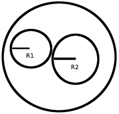

# Desafio Bootcamping Santader Mobile Developer
> Projeto baseado nos desafios propostos pelo Bootcamping Santader Mobile Developer
> 

| Desafio                 | Tema do Desafio                   | Nível do Desafio | Respostas                              |
| ----------------------- | --------------------------------- | ---------------- | -------------------------------------- |
| [Desafio 1](#ancora1)   | Primeiros passos em Kotlin        | Básico           | [Resolução](src/desafios/Desafio1.kt)  |
| [Desafio 2](#ancora2)   | Primeiros passos em Kotlin        | Intermediário    | [Resolução](src/desafios/Desafio2.kt)  |
| [Desafio 3](#ancora3)   | Primeiros passos em Kotlin        | Básico           | [Resolução](src/desafios/Desafio3.kt)  |
| [Desafio 4](#ancora4)   | Solucionando desafios em Kotlin   | Básico           | [Resolução](src/desafios/Desafio4.kt)  |
| [Desafio 5](#ancora5)   | Solucionando desafios em Kotlin   | Básico           | [Resolução](src/desafios/Desafio5.kt)  |
| [Desafio 6](#ancora6)   | Solucionando desafios em Kotlin   | Básico           | [Resolução](src/desafios/Desafio6.kt)  |
| [Desafio 7](#ancora7)   | Solucionando desafios em Kotlin   | Básico           | [Resolução](src/desafios/Desafio7.kt)  |
| [Desafio 8](#ancora8)   | Solucionando desafios em Kotlin   | Básico           | [Resolução](src/desafios/Desafio8.kt)  |
| [Desafio 9](#ancora9)   | Praticando programação com Kotlin | Básico           | [Resolução](src/desafios/Desafio9.kt)  |
| [Desafio 10](#ancora10) | Praticando programação com Kotlin | Básico           | [Resolução](src/desafios/Desafio10.kt) |
| [Desafio 11](#ancora11) | Praticando programação com Kotlin | Intermediário    | [Resolução](src/desafios/Desafio11.kt) |

# [Desafio 1](#ancora)
> Leia dois valores inteiros identificados como variáveis A e B. Calcule a soma entre elas e chame essa variável de **SOMA**.
> A seguir escreva o valor desta variável.

## Entrada
O arquivo de entrada contém 2 valores inteiros.

## Saída
Imprima a variável **SOMA** com todas as letras maiúsculas, inserindo um espaço em branco antes e depois do símbolo de igualdade, seguido pelo valor correspondente à soma de A e B.

| Exemplos de Entrada | Exemplos de Saída |
| ------------------- | ----------------- |
| 30                  | SOMA = 40         |
| 10                  |                   |
| -30                 | SOMA = 20         |
| 10                  |                   |
| 0                   | SOMA = 0          |
| 0                   |                   |

# [Desafio 2](#ancora)

Leia 2 valores de ponto flutuante de dupla precisão A e B, que correspondem a 2 notas de um aluno. A seguir, calcule a média do aluno, sabendo que a nota A tem peso 3.5 e a nota B tem peso 7.5 (A soma dos pesos portanto é 11). Assuma que cada nota pode ir de 0 até 10.0, sempre com uma casa decimal.

## Entrada
O arquivo de entrada contém 2 valores com uma casa decimal cada um.

## Saída
Calcule e imprima a variável **MEDIA** conforme exemplo abaixo, com 5 dígitos após o ponto decimal e com um espaço em branco antes e depois da igualdade. Utilize variáveis de dupla precisão (double) e como todos os problemas, não esqueça de imprimir o fim de linha após o resultado, caso contrário, você receberá "Presentation Error".

| Exemplos de Entrada | Exemplos de Saída |
| ------------------- | ----------------- |
| 5.0                 | MEDIA = 6.43182   |
| 7.1                 |                   |
| 0.0                 | MEDIA = 4.84091   |
| 7.1                 |                   |
| 10.0                | MEDIA = 10.00000  |
| 10.0                |                   |

# [Desafio 3](#ancora3)
Você receberá dois valores inteiros. Faça a leitura e em seguida calcule o produto entre estes dois valores. Atribua esta operação à variável **PROD,** mostrando esta de acordo com a mensagem de saída esperada (exemplo abaixo). 

## Entrada
A entrada contém 2 valores inteiros.

## Saída
Exiba a variável **PROD** conforme exemplo abaixo, tendo obrigatoriamente um espaço em branco antes e depois da igualdade.

| Exemplos de Entrada | Exemplos de Saída |
| ------------------- | ----------------- |
| 3                   | PROD = 27         |
| 9                   |                   |
| -30                 | PROD = -300       |
| 10                  |                   |
| 0                   | PROD = 0          |
| 9                   |                   |

# [Desafio 4](#ancora)
Leia 4 valores inteiros A, B, C e D. Com base nisso, se o valor de B for maior do que de C e se D for maior do que A, e a soma de C com D for maior que a soma de A e B e se tanto C quanto D forem positivos e, ainda, se a variável A for par, escreva a mensagem **"Valores aceitos"**, senão escrever **"Valores nao aceitos"**.

## Entrada
Quatro números inteiros A, B, C e D.

## Saída
Imprima a mensagem corretamente esperada pela validação dos valores.

| Exemplos de Entrada | Exemplos de Saída   |
| ------------------- | ------------------- |
| 5 6 7 8             | Valores nao aceitos |
| 2 3 2 6             | Valores aceitos     |

# [Desafio 5](#ancora)
A seguinte sequência de números 0 1 1 2 3 5 8 13 21... é conhecida como série de Fibonacci. Nessa sequência, cada número, depois dos 2 primeiros, é igual à soma dos 2 anteriores. Escreva um algoritmo que leia um inteiro N (N < 46) e mostre os N primeiros números dessa série.

## Entrada
O arquivo de entrada contém um valor inteiro N (0 < N < 46).

## Saída
Os valores devem ser mostrados na mesma linha, separados por um espaço em branco. Não deve haver espaço após o último valor.

| Exemplos de Entrada | Exemplos de Saída |
| ------------------- | ----------------- |
| 5                   | 0 1 1 2 3         |

# [Desafio 6](#ancora)
Você deve fazer a leitura de 5 valores inteiros. Em seguida mostre quantos valores informados são pares, quantos valores informados são ímpares, quantos valores informados são positivos e quantos valores informados são negativos.

## Entrada
Você receberá 5 valores inteiros.

## Saída
Exiba a mensagem conforme o exemplo de saída abaixo, sendo uma mensagem por linha e não esquecendo o final de linha após cada uma.

| Exemplos de Entrada           | Exemplos de Saída                                            |
| ----------------------------- | ------------------------------------------------------------ |
| -5 0 -3 -4 12 | 3 valor(es) par(es) 2 valor(es) impar(es) 1 valor(es) positivo(s) 3 valor(es) negativo(s) |

# [Desafio 7](#ancora)
Leia 3 valores reais (A, B e C) e verifique se eles formam ou não um triângulo. Em caso positivo, calcule o perímetro do triângulo e apresente a mensagem:

Perímetro = XX.X

Em caso negativo, calcule a área do trapézio que tem A e B como base e C como altura, mostrando a mensagem

Área = XX.X

## Entrada
A entrada contém três valores reais.

## Saída
O resultado deve ser apresentado com uma casa decimal.

| Exemplos de Entrada | Exemplos de Saída |
| ------------------- | ----------------- |
| 6.0 4.0 2.0         | Area = 10.0       |
| 6.0 4.0 2.1         | Perimetro = 12.1  |

# [Desafio 8](#ancora)
A corrida de tartarugas é um esporte que cresceu muito nos últimos anos, fazendo com que vários competidores se dediquem a capturar tartarugas rápidas, e treina-las para faturar milhões em corridas pelo mundo. Porém a tarefa de capturar tartarugas não é uma tarefa muito fácil, pois quase todos esses répteis são bem lentos. Cada tartaruga é classificada em um nível dependendo de sua velocidade:

- Nível 1: Se a velocidade é menor que 10 cm/h .
- Nível 2: Se a velocidade é maior ou igual a 10 cm/h e menor que 20 cm/h .
- Nível 3: Se a velocidade é maior ou igual a 20 cm/h .

Sua tarefa é identificar qual o nível de velocidade da tartaruga mais veloz de um grupo.

## Entrada
A entrada consiste de múltiplos casos de teste, e cada um consiste em duas linhas: A primeira linha contém um inteiro **L** (1 ≤ **L** ≤ 500) representando o número de tartarugas do grupo, e a segunda linha contém **L** inteiros **Vi** (1 ≤ **Vi** ≤ 50) representando as velocidades de cada tartaruga do grupo.

## Saída
Para cada caso de teste, imprima uma única linha indicando o nível de velocidade da tartaruga mais veloz do grupo.

| Exemplos de Entrada                                          | Exemplos de Saída |
| ------------------------------------------------------------ | ----------------- |
| 10 10 10 10 10 15 18 20 15 11 10 10 1 5 2 9 5 5 8 4 4 3 10 19 9 1 4 5 8 6 11 9 7 | 3 1 2     |
# [Desafio 9](#ancora)
Você tem em mãos dois cabos circulares de energia. O primeiro cabo tem raio R1 e o segundo raio R2. Você precisa comprar um conduite circular (veja a imagem abaixo que ilustra um conduite) de maneira a passar os dois cabos por dentro dele:

Qual o menor raio do conduite que você deve comprar? Em outras palavras, dado dois círculos, qual o raio do menor círculo que possa englobar ambos os dois?

## Entrada
Na primeira linha teremos um inteiro T (T ≤ 10000), indicando o número de casos de teste.

Na única linha de cada caso teremos dois números inteiros R1 e R2, indicando os respectivos raios. Os inteiros serão positivos e todas as contas caberão em um inteiro normal de 32 bits.

## Saída
Em cada caso, imprima o menor raio possível em uma única linha

| Exemplos de Entrada | Exemplos de Saída |
| ------------------- | ----------------- |
| 3                   |                   |
| 1 1                 | 2                 |
| 2 8                 | 10                |
| 8 2                 | 10                |

# [Desafio 10](#ancora)
Duas motos (X e Y) partem em uma mesma direção. A moto X sai com velocidade constante de 60 Km/h e a moto Y sai com velocidade constante de 90 Km/h.

Em uma hora (60 minutos) a moto Y consegue se distanciar 30 quilômetros da moto X, ou seja, consegue se afastar um quilômetro a cada 2 minutos.

O seu desafio é ler a distância (em Km) e calcular quanto tempo leva (em minutos) para a moto Y tomar essa distância da outra moto.

## Entrada
O arquivo de entrada contém um número inteiro **K** que representa a quantidade de quilômetro que que a moto Y deve estar da moto X.

## Saída
Imprima o tempo necessário para a moto Y ficar com a quantidade **K** de quilômetro da moto X, seguido da mensagem " minutos".

| Exemplos de Entrada | Exemplos de Saída |
| ------------------- | ----------------- |
| 30                  | 60 minutos        |
| 110                 | 220 minutos       |
# [Desafio 11](#ancora)
Faça a leitura de um valor inteiro. Em seguida, calcule o menor número de notas possíveis (cédulas) onde o valor pode ser decomposto. As notas que você deve considerar são de 100, 50, 20, 10, 5, 2 e 1. Na sequência mostre **o valor lido** e a relação de notas necessárias.

## Entrada
Você receberá um valor inteiro **N** (0 < **N** < 1000000).

## Saída
Exiba o valor lido e a quantidade mínima de notas de cada tipo necessárias, seguindo o exemplo de saída abaixo. Após cada linha deve ser imprimido o fim de linha.

| Exemplos de Entrada | Exemplos de Saída                                            |
| ------------------- | ------------------------------------------------------------ |
| 576                 | 576 5 nota(s) de R$ 100,00 1 nota(s) de R$ 50,00 1 nota(s) de R$ 20,00 0 nota(s) de R$ 10,00 1 nota(s) de R$ 5,00 0 nota(s) de R$ 2,00 1 nota(s) de R$ 1,00 |
| 11257               | 11257 112 nota(s) de R$ 100,00 1 nota(s) de R$ 50,00 0 nota(s) de R$ 20,00 0 nota(s) de R$ 10,00 1 nota(s) de R$ 5,00 1 nota(s) de R$ 2,00 0 nota(s) de R$ 1,00 |
| 503                 | 5 nota(s) de R$ 100,00 0 nota(s) de R$ 50,00 0 nota(s) de R$ 20,00 0 nota(s) de R$ 10,00 0 nota(s) de R$ 5,00 1 nota(s) de R$ 2,00 1 nota(s) de R$ 1,00 |
